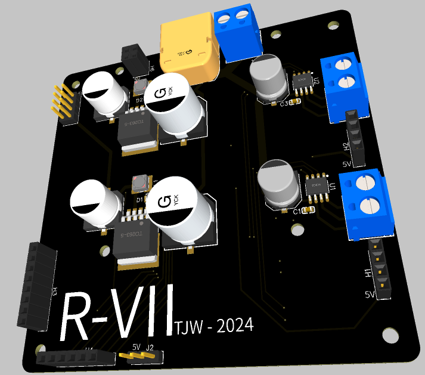
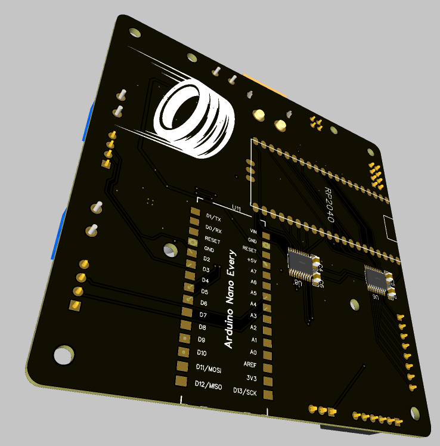

# Ralph 7 

## The Project

Ralph 7 is the latest itteration of an ongoing mobile platform, this is intended to serve as a basis for learning, a platform to build on, see [iRIS](https://github.com/Wattersto08/iris) and my [gps](https://github.com/Wattersto08/Ros2-GPS-VK-162) package so far. 

This is running the following hardware:

- RPI 4 running ubuntu mate 20.04 
- rplidar a1m8 for the lidar module
- intel RealSense d435i stereo camera 
- GL.inet router 
- waveshare powered usb hub 
- 3S lipo for power 
- VK-162 for gps output
- foxglove for non-linux platform control
- [Josh Newans](https://github.com/joshnewans) fantastic and simple to implement diffdrive ros2 control nodes. 

This project has taken heavy influence from Josh's tutorials and guides.

## Todo

This list is divided into specific lists to cover each remit of the project. 

### ROS2 goals 
- [ ] get the maploader working. 
- [ ] add logic to load the correct map based on initial GPS coordinates. 
- [ ] implement AMCL for navigation and mapping.
- [ ] tune AMCL for best performance.
- [ ] create a bigger map of my flat, ralph was for more than just the bedroom! 
- [ ] generate a new URDF based on the fusion 360 CAD model. 
- [ ] create bash script for initialising and installing all required packages and utils. 

### Hardware goals 
- [ ] look into new wheels for the platform, I fear the current foam RC wheels are not up to the job and are not performing well on carpeted surfaces. [these](https://www.amazon.co.uk/gp/product/B07F9SSSND/ref=ox_sc_act_title_1?smid=A10EGWLGS2DC0K&psc=1) look like great candidates.
- [ ] tune the PID and validate the ros2 control surfaces.
- [ ] more scientifically measure the correct pulses per revolution of the DC encoder motors. 
- [ ] implement a uROS mcu to make the following objects availible within ros2: 
- [ ] VBUS - battery voltage 
- [ ] some sort of local temperature and humidity measurements. 
- [ ] add ros2 control of the 36 neopixel's used for the headlights and status LED's. 
- [ ] design an all new PCB for consolidating the various modules being used. 
- [ ] design / source a new castor wheel, the current one is generating a lot of resistance, amplifying the issue with the wheels. 
- [ ] order and validate the latest PCB. 
- [ ] Fix Castor mount hight, currently too low. 
- [ ] add current motor controller parts to one large plate. 
- [ ] add active cooling to the chassis. 
- [ ] Create mechanical BOM. 

### PCB Design

As part of this project I have designed the following PCB:

The gerber files and BOM can be found in /docs/PCB, this was designed in easyEDA and intended to be ordered from jlcpcb and lcsc electronics, this will make ordering and manufacturing straightforward. 

This aims to solve: 

- dedicated 5V4A psu for the RPI 
- dedicated 5V4A psu for auxillery devices
- upgraded DC motor control using [A4950ELJTR](https://www.lcsc.com/product-detail/Brushed-DC-Motor-Drivers_MSKSEMI-A4950ELJTR-T-MS_C7473144.html) brushed motor controllers, these are much more efficiant that the outdate L298n dual H-bridge being used at the moment. 
- adds a RPI pico 2 for uROS integration 
- solid mount points for the rpi 
- DC input for bench testing 
- XT60 jack for LIPO connection
- outputs for GPIO and neopixels. 

### Mechanical Design

all parts have been designed around [MakerBeam](https://www.makerbeam.com/) 10x10 Components, these are readily availible and server as a great base to build off. 

Prints were designed within Fusion 360 and printed in PLA on the bambulab P1S, STL's are in the Print Files dir. 

